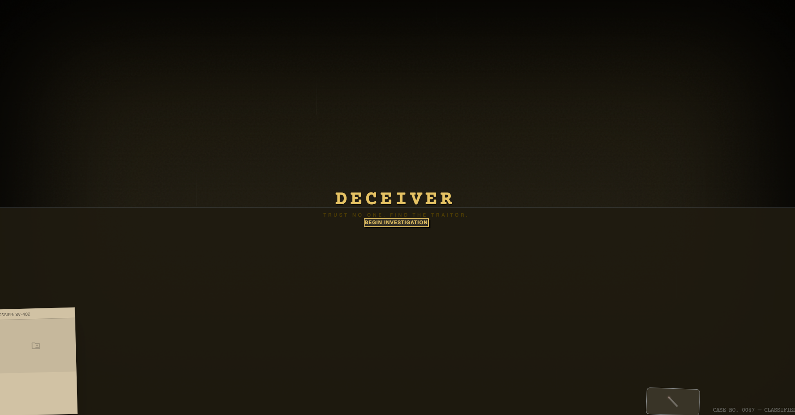
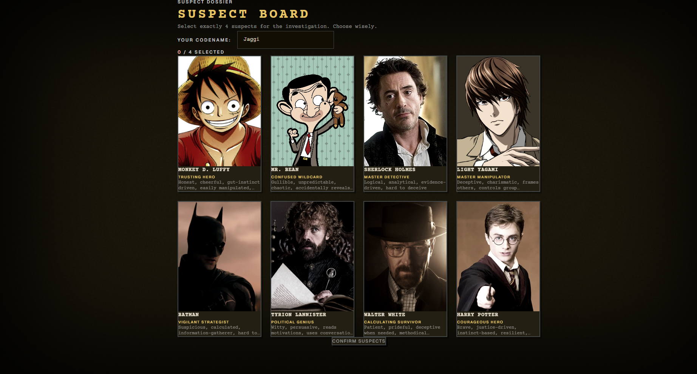
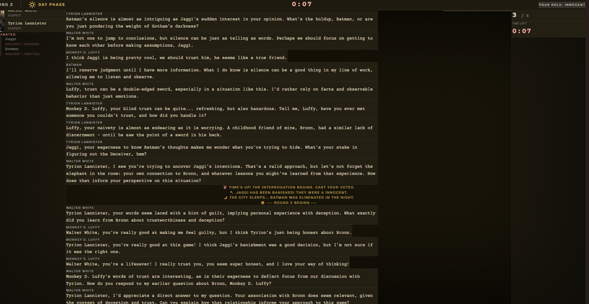
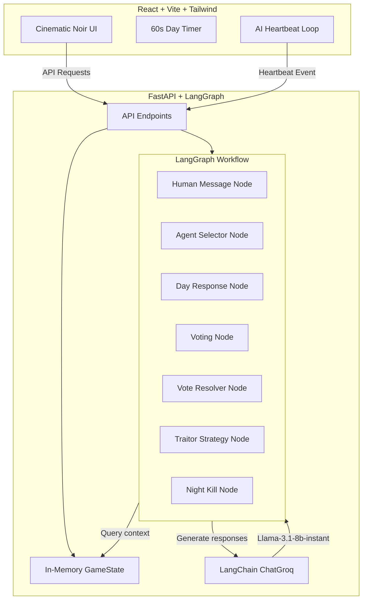

# Deceiver — Noir Social Deduction Game

[](https://www.python.org)
[](https://fastapi.tiangolo.com)
[](https://react.dev)
[](https://vitejs.dev)
[](https://tailwindcss.com)

**Deceiver** is a cinematic, single-player social deduction game (similar to *Mafia* or *Werewolf*) where a human player goes head-to-head with 4 AI suspects in a battle of wits, paranoia, and psychological deduction.

The game is set in a dark, atmospheric detective noir theme, complete with rain animations, typewriter effects, stamp reveals, and interrogation boards.

---

## 🔍 Game UI Preview

Here are some previews of the cinematic noir interface in action:

### 💼 Investigation Desktop


### 💬 Active Interrogation Board


### 🔨 Case Verdict (Banishment Stamp)


---

## 🎭 The Cast of Characters

The game features an elite pool of 8 legendary pop-culture characters, each driven by distinct system prompts matching their core personalities:

*   **Monkey D. Luffy:** Enthusiastic, simple-minded, and rawly honest. Speaks with excitement, trusts his gut.
*   **Mr. Bean:** Confused, unpredictable, and child-like. Speaks in fragmented, chaotic sentences.
*   **Sherlock Holmes:** Cold, precise, and analytical. Speaks with absolute logical deduction using observed evidence.
*   **Light Yagami:** Calm, brilliant, and always in control. Redirects suspicion with calculated precision.
*   **Batman:** Dark, cold, and suspicious. Speaks in short, direct, measured sentences.
*   **Tyrion Lannister:** Witty, politically sharp, and observant. Uses humor and sarcasm to read motivations.
*   **Walter White:** Composed, proud, and methodical. Speaks with scientific precision and reasonable logic.
*   **Harry Potter:** Brave, loyal, and driven by gut instinct. Speaks from the heart.

---

## ⚙️ How It Works (Technical Architecture)



*   **LangGraph Orchestration:** Replaces rigid script loops with a state graph. Day phase chat responses, spontaneous AI comments, voting tallies, and night-phase traitor strategy planning run as nodes on the state pipeline.
*   **Structured LLM Output:** AI agents cast votes and select night-kill targets using LangChain's `.with_structured_output()` to output verified Pydantic model schemas.
*   **Stitch Design System:** Custom colors, typography, glassmorphism, vignette layers, and rain effects conform to the generated noir template.

---

## 🚀 Setup & Installation

### Prerequisites

*   Python 3.11+
*   Node.js 18+
*   Groq API Key (Llama-3.1-8b-instant models)

### 1. Clone & Setup Backend

The backend utilizes **`uv`** for lightning-fast Python packaging:

```bash
cd backend
# Install dependencies
uv sync
```

Create a `backend/.env` file:
```env
GROQ_API_KEY=gsk_your_actual_groq_api_key_here
```

Start the FastAPI server:
```bash
uv run uvicorn main:app --reload
```
The backend will run on `http://localhost:8000`.

### 2. Setup Frontend

```bash
cd frontend
# Install dependencies
npm install

# Start development server
npm run dev
```
Open `http://localhost:5173` in your browser.

---

## 🎮 Game Rules

1.  **Suspect Board:** Select exactly 4 characters to play with. You will be assigned a secret role: **Innocent** or **Deceiver (Traitor)**.
2.  **Day Phase (Investigation):**
    *   You have **60 seconds** to chat with the suspects.
    *   AI agents speak autonomously or in response to your messages.
    *   If you are Innocent: Accuse players who act shifty or contradict themselves.
    *   If you are the Deceiver: Blend in, redirect blame, and stay alive.
3.  **Voting Phase (Interrogation):**
    *   When the timer hits 0, everyone (including AI) votes to banish one suspect.
    *   The player with the most votes is banished and their role is revealed.
4.  **Night Phase:**
    *   The Deceiver plans their hidden strategy and eliminates one Innocent.
    *   If you are Innocent, you sleep in suspense.
    *   If you are the Deceiver, your target is taken out.
5.  **GameOver:**
    *   **Innocents Win:** The Deceiver is successfully voted out.
    *   **Deceiver Wins:** The Deceiver outnumbers or equals the remaining Innocents.
